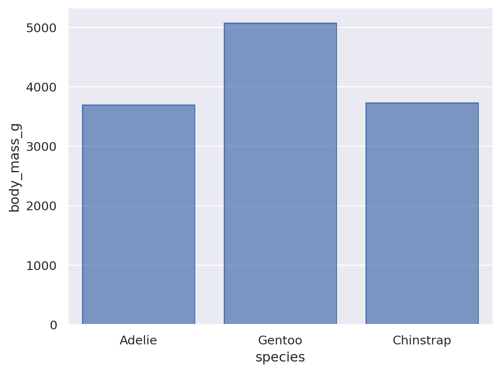

# Homework 1: Tool Setup

Kenny Bush 
CS 625, Fall 2024  
Due: September 8, 2024

## Git, GitHub

### Q1 - URL of GitHub Repo

([HW1-report.md](https://github.com/rkbush12/rkbush12/edit/main/HW1-report.md))

### Q2 - Pull Command

Git Pull command brings remote changes to the local repository

### Q3 - Local Commits

If I committed a change on my local machine and do not see a change on Github.com, then I may have forgotten to push my changes to the remote repository.

### References

git-guides git-pull, <https://github.com/git-guides/git-pull>  
Why are my contributions not showing up on my profile?, <https://docs.github.com/en/account-and-profile/setting-up-and-managing-your-github-profile/managing-contribution-settings-on-your-profile/why-are-my-contributions-not-showing-up-on-my-profile>  

## Markdown

### Q1 - Bulleted List

- Waffels
- Peanut butter
- Syrup

A numbered list uses numbers to indicate a specific order, suggesting a ranking among the items.

### Q2 - Markdown Paragraph

If you've ever wondered, *how much wood could a woodchuck chuck if a woodchuck could chuck wood*, the answer is both amusing and intriguing. **A woodchuck** could theoretically chuck around ***700 pounds*** of wood. For more details, check out this [Wikipedia article](https://en.wikipedia.org/wiki/How_much_wood_would_a_woodchuck_chuck%3F). In `code`, it might look like this: `woodchuck_chuck(wood)`.

### Q3 - Animal Image

### References

Wikipedia article "How much wood would a woochuck chuck?" <https://en.wikipedia.org/wiki/How_much_wood_would_a_woodchuck_chuck%3F>

## Tableau

### Q1 - Region Other Than the South

## Google Colab

### Q1 - URL of Google Colab Notebook

<https://colab.research.google.com/drive/1FM_LquL4BSJkOzuWKpzl1uzW7jJ-Xak5?usp=sharing>

## Python/Seaborn

### Q1 - First Penguin Image

### Q2 - Second Penguin Image

### Q3 - Outer Parenthesis

SyntaxError occured. The code was not complete, saying the error was on line 3 after so.Agg() needing a closing parenthesis. 

## Observable and Vega-Lite

### Q1 - markCircle to markSquare

On the scatterplot the data points change from circle to squares.

### Q2 - markCircle to markPoint

On the scatterplot the data points changes from a filled circles to a unfilled circles.

### Q3 - Swap X and Y Axes on Scatterplot

The axes with y becoming miles_per_gallon and x being horsepower.

### Q4 - Remove fieldN(Origin)

The data point tooltip with hovering over a data point goes away.

