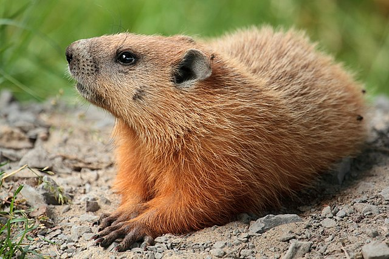
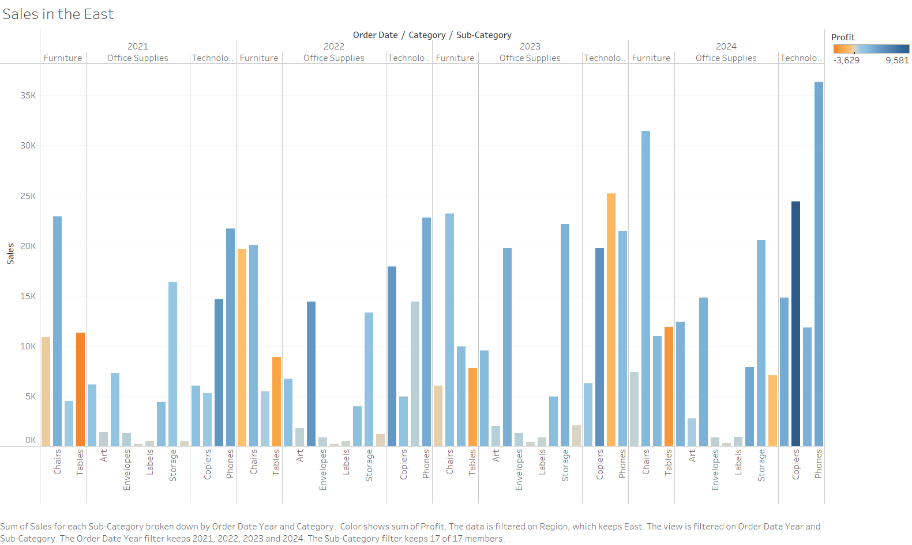

# Homework 1: Tool Setup

Kenny Bush 
CS 625, Fall 2024  
Due: September 8, 2024

## Git, GitHub

### Q1 - URL of GitHub Repo

(https://github.com/rkbush12/kbush12-625.git)

### Q2 - Pull Command

Git Pull command brings remote changes to the locl repository

### Q3 - Local Commits

If I committed a change on my local machine and do not see a change on Github.com, then I may have forgoteen to push my changes to the remote repository.

### References

git-guides git-pull, <https://github.com/git-guides/git-pull>  
Why are my contributions not showing up on my profile?, <https://docs.github.com/en/account-and-profile/setting-up-and-managing-your-github-profile/managing-contribution-settings-on-your-profile/why-are-my-contributions-not-showing-up-on-my-profile>  

## Markdown

### Q1 - Bulleted List

- Waffels
- Peanut butter
- Syrup

A numbered list uses numbers to indicate a specific order, suggesting a ranking among the items.

### Q2 - Markdown Paragraph

If you've ever wondered, *how much wood could a woodchuck chuck if a woodchuck could chuck wood*, the answer is both amusing and intriguing. **A woodchuck** could theoretically chuck around ***700 pounds*** of wood. For more details, check out this [Wikipedia article](https://en.wikipedia.org/wiki/How_much_wood_would_a_woodchuck_chuck%3F). In `code`, it might look like this: `woodchuck_chuck(wood)`.

### Q3 - Animal Image

### References

Insert the list of any references you used here. *If you did not use any references for this section, you may remove this subsection.*

## Tableau

### Q1 - Region Other Than the South

## Google Colab

### Q1 - URL of Google Colab Notebook

Insert your answer and explanation here

### References

Insert the list of any references you used here. *If you did not use any references for this section, you may remove this subsection.*

## Python/Seaborn

### Q1 - First Penguin Image

Insert your answer and explanation here

### Q2 - Second Penguin Image

Insert your answer and explanation here

### Q3 - Outer Parenthesis

Insert your answer and explanation here

### References

Insert the list of any references you used here. *If you did not use any references for this section, you may remove this subsection.*

## Observable and Vega-Lite

### Q1 - markCircle to markSquare

Insert your answer and explanation here

### Q2 - markCircle to markPoint

Insert your answer and explanation here

### Q3 - Swap X and Y Axes on Scatterplot

Insert your answer and explanation here

### Q4 - Remove fieldN(Origin)

Insert your answer and explanation here

### References

Insert the list of any references you used here. *If you did not use any references for this section, you may remove this subsection.*
